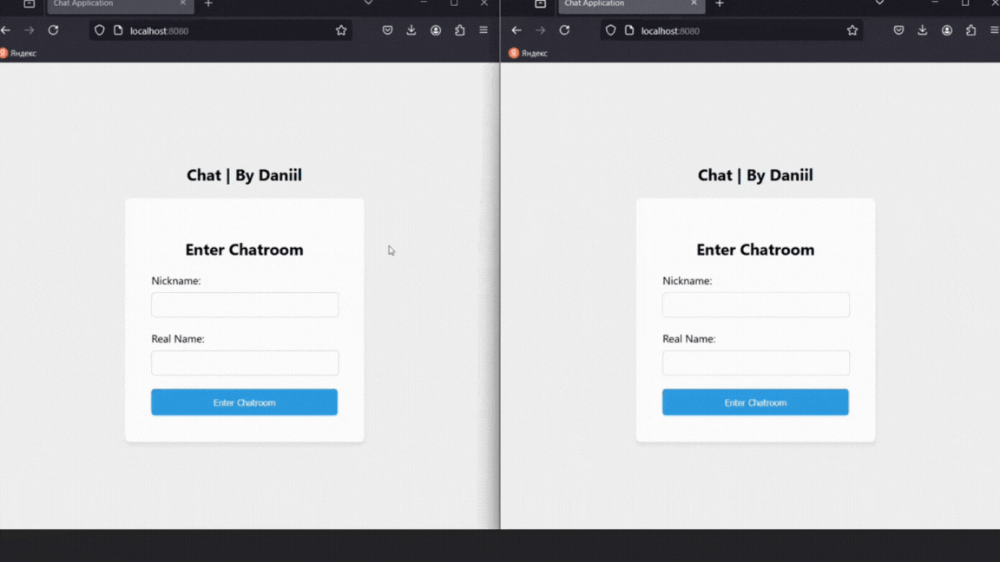

# Chat WebSocket Project

This is the Websocket Chat project

## Overview

This project is a chat room where users can communicate with each other in real time.

## Technologies

  - Java 17
  - Spring Boot 3.3.5
  - Websocket
  - MongoDB
  - Lombok
  - Docker Compose
  - HTML
  - CSS
  - JavaScript

## Demonstration

#### The main functionality

<br>

## Installation

```bash
# Clone the repository
git clone https://github.com/AstafevDan/chat.git

# Change into the project directory
cd your-project
```
Then:
  1. Rename **example-application.yml** (src/main/resources) to **application.yml** and set your username and password to connect to the database.
  2. In the **compose.yaml** file enter your values for the following environment variables (preferably as in **application.yml**):
     - MONGO_INITDB_ROOT_USERNAME
     - MONGO_INITDB_ROOT_PASSWORD
     - ME_CONFIG_MONGODB_ADMINUSERNAME
     - ME_CONFIG_MONGODB_ADMINPASSWORD

The application is ready to launch. Now, at the command prompt in the root of the project, type (You need Docker installed on your computer):

```bash
# Build, create and start containers
docker compose up -d

# Build the project and run the application
./gradlew bootRun
``` 
Now open in your browser the following address: 

http://localhost:8080/
